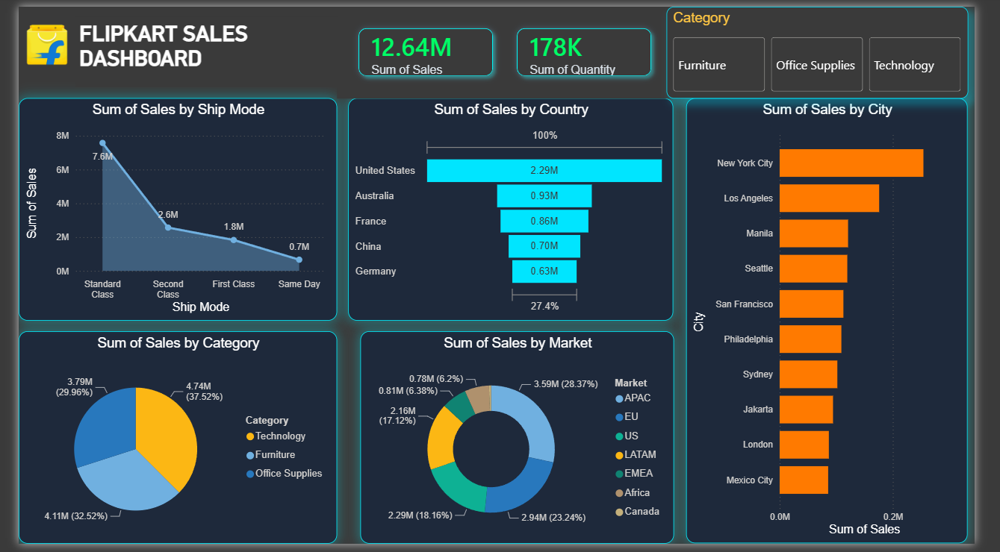

<!-- ====================================================== -->

<!--                    HERO SECTION                       -->

<!-- ====================================================== -->

<p align="center">
  
</p>

<p align="center">

### 📊 Power BI • Business Intelligence • Data Analytics

**An interactive sales intelligence dashboard designed to transform raw e-commerce data into actionable business insights.**

</p>

<br>

<p align="center">

<a href="#-dashboard">

</a>

<a href="#-key-insights">

</a>

<a href="#-technology-stack">

</a>

<a href="#-run-the-project">

</a>

</p>

<br>

<p align="center">


</p>

---

<!-- ====================================================== -->

<!--                  NAVIGATION                           -->

<!-- ====================================================== -->

<p align="center">

<a href="#-overview">Overview</a>
  •   <a href="#-dashboard">Dashboard</a>
  •   <a href="#-key-insights">Insights</a>
  •   <a href="#-workflow">Workflow</a>
  •   <a href="#-technology-stack">Technology</a>
  •   <a href="#-run-the-project">Run</a>

</p>

---

# ✦ Overview

<table>
<tr>

<td width="55%" valign="top">

## Turning Data Into Decisions

The **Flipkart Sales Dashboard** is a Power BI Business Intelligence project built to analyze e-commerce sales performance across geographic, product, shipping, and market dimensions.

The project takes raw Excel data through a complete analytics pipeline:

**Clean → Transform → Model → Measure → Visualize → Analyze**

The final result is an interactive dashboard designed for fast business exploration.

</td>

<td width="45%" valign="top">

### Project Snapshot

|                     |                           |
| ------------------- | ------------------------- |
| 🎯 **Type**         | Business Intelligence     |
| 📊 **Platform**     | Power BI                  |
| 📗 **Dataset**      | Excel                     |
| 🧮 **Calculations** | DAX                       |
| 🧹 **ETL**          | Power Query               |
| 🎛️ **Interaction** | Slicers + Cross Filtering |
| 🌑 **Theme**        | Dark Analytics            |
| 🚦 **Status**       | Completed                 |

</td>

</tr>
</table>

---

# ◈ Dashboard

<p align="center">



</p>

<p align="center">

<a href="dashboard_preview.png">

</a>

</p>

### Designed for Exploration

The dashboard allows users to interactively explore:

`Category` → `Sales` → `Country` → `City` → `Market`

with connected visuals updating dynamically.

---

# ◈ Executive Metrics

<table>
<tr>

<td align="center" width="25%">

## 💰

# 12.64M

**TOTAL SALES**

</td>

<td align="center" width="25%">

## 📦

# 178K

**TOTAL QUANTITY**

</td>

<td align="center" width="25%">

## 🌍

# 7

**MARKETS**

</td>

<td align="center" width="25%">

## 🏙️

# 10

**TOP CITIES**

</td>

</tr>
</table>

<br>

<p align="center">

<sub>Current values reflect the dashboard configuration and source dataset.</sub>

</p>

---

# ◈ Analytics Engine

<table>
<tr>

<td width="33%" align="center">

## 🚚

### Ship Mode

Compare sales across:

**Standard Class**
**Second Class**
**First Class**
**Same Day**

</td>

<td width="33%" align="center">

## 🌎

### Geography

Analyze:

**Country**
**City**
**Market**

</td>

<td width="33%" align="center">

## 📦

### Products

Compare:

**Technology**
**Furniture**
**Office Supplies**

</td>

</tr>
</table>

---

# ◈ Interactive Experience

<p align="center">


</p>

### 🎛️ Dynamic Category Analysis

Users can select:

```text
┌───────────────────────┐
│  CATEGORY             │
├───────────────────────┤
│  ○ Furniture          │
│  ○ Office Supplies    │
│  ○ Technology         │
└───────────────────────┘
```

Once selected, connected visualizations respond to the chosen category.

---

# ◈ Key Insights

<table>
<tr>

<td width="50%" valign="top">

### 01 · Shipping

**Standard Class**

generates the highest sales among the displayed shipping modes.

</td>

<td width="50%" valign="top">

### 02 · Country

**United States**

is the highest-performing country among the displayed countries.

</td>

</tr>

<tr>

<td width="50%" valign="top">

### 03 · City

**New York City**

ranks first among the displayed top 10 cities.

</td>

<td width="50%" valign="top">

### 04 · Category

**Technology**

contributes the largest share of sales among the displayed categories.

</td>

</tr>

</table>

---

# ◈ Global Market View

<p align="center">

`APAC`   `EU`   `US`   `LATAM`   `EMEA`   `AFRICA`   `CANADA`

</p>

The market visualization provides a high-level comparison of sales contribution across different global regions.

---

# ◈ Data Architecture

```text
                         ┌───────────────────┐
                         │   EXCEL DATASET   │
                         └─────────┬─────────┘
                                   │
                                   ▼
                         ┌───────────────────┐
                         │   POWER QUERY     │
                         │ Clean + Transform │
                         └─────────┬─────────┘
                                   │
                                   ▼
                         ┌───────────────────┐
                         │   DATA MODEL      │
                         └─────────┬─────────┘
                                   │
                                   ▼
                         ┌───────────────────┐
                         │       DAX         │
                         │ Measures + KPIs   │
                         └─────────┬─────────┘
                                   │
                                   ▼
                         ┌───────────────────┐
                         │     POWER BI      │
                         │   Visualization   │
                         └─────────┬─────────┘
                                   │
                                   ▼
                         ┌───────────────────┐
                         │ BUSINESS INSIGHTS │
                         └───────────────────┘
```

---

# ◈ Data Preparation

<details>
<summary><b>01 · Import & Inspect</b></summary>

Import the Excel dataset and inspect columns, data types, and data quality.

</details>

<details>
<summary><b>02 · Clean</b></summary>

Remove unnecessary columns, handle missing values, remove duplicates, and clean text fields.

</details>

<details>
<summary><b>03 · Transform</b></summary>

Format numerical fields, standardize values, and prepare analytical columns using Power Query.

</details>

<details>
<summary><b>04 · Model</b></summary>

Build the Power BI data model and prepare the dataset for analytical calculations.

</details>

<details>
<summary><b>05 · Measure</b></summary>

Create DAX measures for KPIs and dashboard analysis.

</details>

<details>
<summary><b>06 · Visualize</b></summary>

Build interactive charts, KPI cards, slicers, and business insight visuals.

</details>

---

# ◈ Technology Stack

<p align="center">


</p>

<table>
<tr>
<th>Technology</th>
<th>Role</th>
</tr>

<tr>
<td>📊 Power BI</td>
<td>Dashboard & Visualization</td>
</tr>

<tr>
<td>🧹 Power Query</td>
<td>Data Cleaning & Transformation</td>
</tr>

<tr>
<td>📐 DAX</td>
<td>Measures & Calculations</td>
</tr>

<tr>
<td>📗 Excel</td>
<td>Source Dataset</td>
</tr>

<tr>
<td>🗂️ Data Modeling</td>
<td>Analytical Structure</td>
</tr>

</table>

---

# ◈ Visual Design System

```text
BACKGROUND
#071A2B

SURFACE
#0B2438

PRIMARY
#00E5FF

SECONDARY
#00BFFF

ACCENT
#FF7A00

TEXT
#D9E1E8
```

### Design Philosophy

**Dark interface + cyan accents + clean typography + focused KPIs + minimal visual noise**

The goal is to make important business information immediately visible.

---

# ◈ Project Structure

```text
Flipkart-PowerBI-Dashboard/
│
├── 📄 README.md
│
├── 🖼️ dashboard_preview.png
│
├── 📊 Flipkart_Sales_Dashboard.pbix
│
└── 📗 Flipkartsales.xlsx
```

---

# ◈ Run the Project

### 01 · Clone

```bash
git clone https://github.com/abutalha0649/Flipkart-PowerBI-Dashboard.git
```

### 02 · Open

Launch:

```text
Flipkart_Sales_Dashboard.pbix
```

with **Power BI Desktop**.

### 03 · Dataset

Ensure:

```text
Flipkartsales.xlsx
```

is available in the project directory.

### 04 · Refresh

Inside Power BI:

```text
Home → Refresh
```

### 05 · Explore

```text
Category
   ↓
Visuals
   ↓
Cross Filtering
   ↓
KPIs
   ↓
Business Insights
```

---

# ◈ Future Roadmap

<table>
<tr>

<td align="center">

### 📅

**Sales Trends**

Monthly & yearly analysis

</td>

<td align="center">

### 💰

**Profit**

Profit & margin analysis

</td>

<td align="center">

### 👥

**Customers**

Customer segmentation

</td>

</tr>

<tr>

<td align="center">

### 🌍

**Maps**

Interactive geographic analysis

</td>

<td align="center">

### 🔎

**Drill Through**

Detailed analytical pages

</td>

<td align="center">

### ☁️

**Power BI Service**

Cloud deployment

</td>

</tr>

</table>

---

# ◈ Learning Outcomes

<p align="center">

`DATA CLEANING`
  →  
`DATA TRANSFORMATION`
  →  
`DATA MODELING`
  →  
`DAX`
  →  
`VISUALIZATION`
  →  
`BUSINESS INTELLIGENCE`

</p>

### Skills Practiced

* Data Cleaning
* Power Query
* Data Transformation
* Data Modeling
* DAX
* KPI Development
* Data Visualization
* Dashboard Design
* Business Intelligence
* Business Insight Generation

---

# ◈ About

<p align="center">


### 🎓 B.Tech — Information Technology

### 📊 Aspiring Data Analyst

</p>

<p align="center">


</p>

---

# ◈ Connect

<p align="center">

<a href="https://github.com/abutalha0649">

</a>

<a href="https://linkedin.com/in/mohammadabutalha">

</a>

</p>

---

# ⭐ Like This Project?

<p align="center">

<a href="https://github.com/abutalha0649/Flipkart-PowerBI-Dashboard">

</a>

</p>

<p align="center">

<b>Every dataset tells a story.
The goal is to make that story actionable. 📊</b>

</p>

---

<p align="center">


</p>

<p align="center">

**© 2026 Mohammad Abu Talha • Flipkart Sales Dashboard**

</p>
